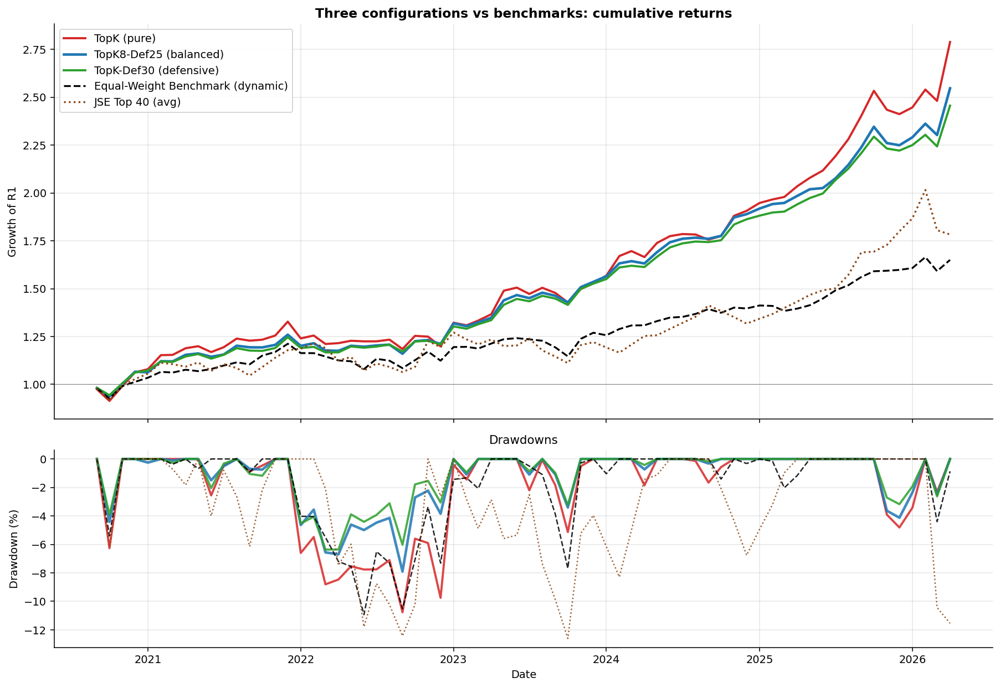
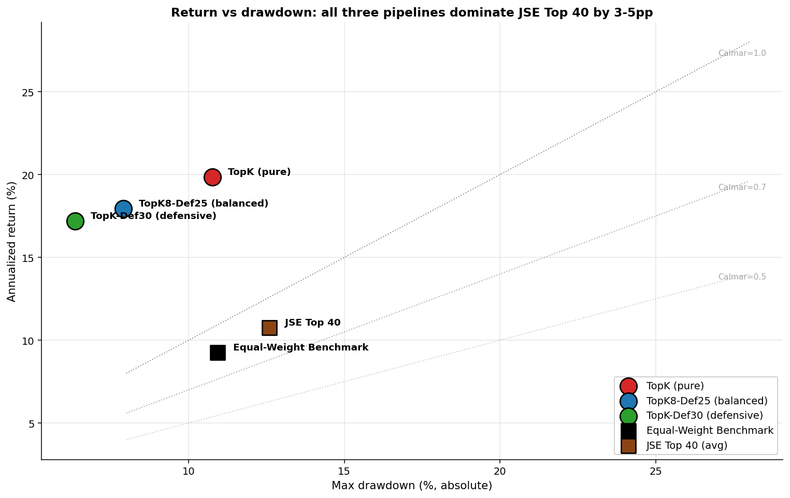
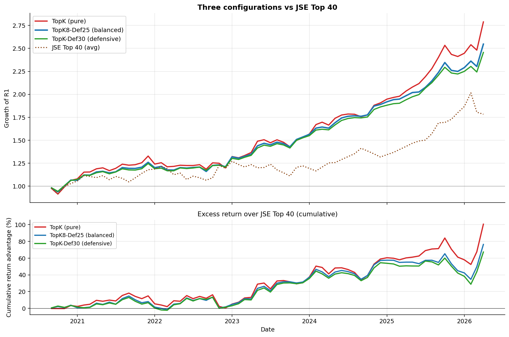
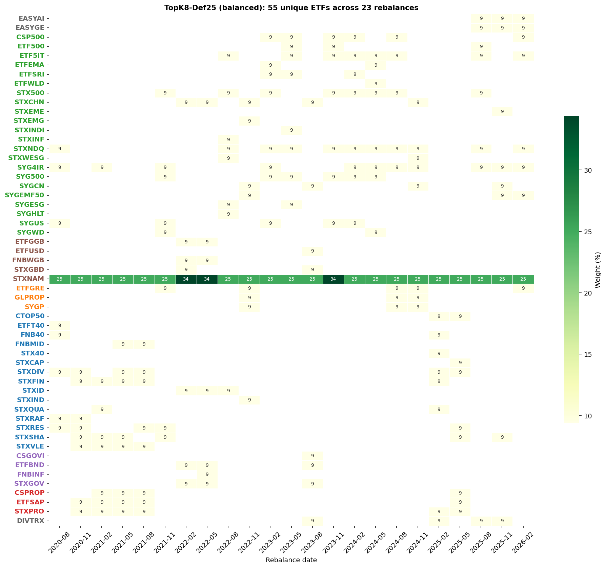

::: {.callout-note}
This is not financial advice.
:::

I’ve been working on this ETF-picking framework for so long that my code probably deserves anniversary flowers. When it comes to a TFSA, most people toss a couple of ETFs in there, let compounding do its quiet magic, and move on with their lives. Me? I went full nerd and built a machine-learning pipeline with macro-conditional features and Bayesian shrinkage. The payoff: a system that outpaces the JSE Top 40 by 6.4 to 9.1 percentage points annualized, with Sharpe ratios twice as high — all while I keep insisting this is “just passive investing”. Over-engineered retirement planning? Guilty as charged.

The **macro-conditional features** is the real star of the show. This lets the model learn that the
same momentum reading means something different in a high-vol regime
than in a calm one — a regime-dependence that pure momentum signals
cannot capture. The sophistication lives entirely in the forecast — the rest is just me pretending I’m not running a glorified “sort and slice” function.

## Portfolio rules and caveats

- An ETF only becomes eligible for selection when more than 6 months of data is available,
- Rebalancing occurs at a quarterly frequency,
- Only $K=8$ ETFs are allowed in the portfolio. If you can make it to the end of the post you will understand why.
- I am only considering ETFs that are eligible for TFSA and available on EE. Why? Because I’ve been hoarding data on them like a dragon sitting on a pile of CSV files.   
- The out-of sample test is not nearly as long as I would like. It’s basically the financial equivalent of a movie trailer — just enough to get you excited, but not enough to prove the plot won’t collapse halfway through so please read the disclaimer up top again! 

## Data

73 TFSA-listed ETFs from January 2019 to April 2026. The universe
spans six broad categories:

| Category | Count |
|---|---|
| Global Equity | 30 |
| Local Equity | 18 |
| Local Income | 7 |
| Global Income | 5 |
| Global REIT | 4 |
| Local REIT | 3 |
| Multi-Asset / Other | 6 |

I use three macro time series from FRED:

| Series | FRED ID | What it measures |
|---|---|---|
| USD/ZAR exchange rate | `EXSFUS` | Rand strength against the US dollar |
| US 10-Year Treasury yield | `GS10` | Global rate environment |
| CBOE VIX | `VIXCLS` (monthly avg) | Global equity risk sentiment |

Monthly returns are computed from each ETF's total-return series. No cheating is allowed — features and forecasts at time $t$ only use
data through $t$.

The JSE top40 benchmark is the average return of the JSE top 40 ETFs. The equal weighting benchmark is the result of buying every ETF (when they are available) and allocating equal weights.

## The pipeline

Four sequential steps. Steps 1-3 produce a calibrated posterior
forecast of expected returns per ETF; Step 4 converts that into
portfolio weights.

### Step 1: LightGBM panel forecast

I build a "panel" — one row per (ETF $i$, month $t$) combination —
with **9 feature columns** plus the next-month return as the target.
LightGBM is trained on this panel to predict expected return per ETF
per month.

The 8 features split into two groups:

- **Feature group A (5 features): ETF-level signals.** Tell the model
  what each ETF has been doing — momentum, volatility, risk-adjusted
  momentum, etc.
- **Feature group B (3 features): macro-conditional interactions.**
  Tell the model what *kind of environment* the ETF is operating in.
  These are the most important features in the pipeline.

The macro interactions are not optional add-ons — they are responsible
for most of the pipeline's edge. 

#### Feature group A: ETF-level features (5)

These describe each ETF's own price behaviour:

$$
\begin{aligned}
\text{mom}_{6-1, i, t} &= \sum_{s=t-6}^{t-1} \log(1 + r_{i, s}) \\
\text{mom}_{3-1, i, t} &= \sum_{s=t-3}^{t-1} \log(1 + r_{i, s}) \\
\sigma_{i, t} &= \sqrt{12} \cdot \text{stdev}(r_{i, t-5:t-1}) \\
\text{mom\_scaled}_{i, t} &= \text{mom}_{6-1, i, t} \;/\; \sigma_{i, t} \\
\text{defensive}_{i, t} &= 1 \;/\; \sigma_{i, t}
\end{aligned}
$$

**What each variable means:**

- $r_{i, s}$ — simple monthly return of ETF $i$ in month $s$
- **$\text{mom}_{6-1}$** — 6-month log-return ending one month back.
  Captures medium-term trend. The "$-1$" lag avoids using same-month
  return as both feature and target.
- **$\text{mom}_{3-1}$** — 3-month log-return ending one month back.
  Captures shorter-term trend; reacts faster than the 6-month version.
- **$\sigma_{i, t}$** — annualized volatility over the past 6 months.
  Higher = more risky.
- **$\text{mom\_scaled}$** — risk-adjusted momentum. A 10% gain on a
  high-vol ETF is less convincing than the same gain on a stable ETF.
- **$\text{defensive}$** — inverse volatility. A "stability score";
  high values flag low-vol ETFs (bonds, income, defensive equities).

#### Feature group B: Macro-conditional interaction features

The 5 ETF-level features above tell the model *what each ETF has been
doing*. They don't tell it *what kind of environment that's happening
in*. Adding macro context is essential — but the way macros are
encoded matters enormously, and the naive approach fails badly.

Pure ETF features are regime-blind. A 10% rally looks the same whether it’s March 2020 (VIX screaming at 50, world on fire) or January 2024 (VIX chilling at 14, markets sipping piña coladas). Without macro context, the model is basically that friend who insists “all parties are the same” — which is why we had to teach it that a rave at 3 a.m. is not the same as a Sunday brunch. Enter macro interactions: multiplying ETF signals by z-scored macros so the model finally stops being socially oblivious.

The obvious fix is to add macro variables as new columns to the panel:

```text
panel columns (naive approach):
  [mom_3_1, mom_6_1, vol_recent, mom_scaled, defensive,
   vix_level, usdzar_mom6, us10y_mom6]
```

I tested this. It *hurt* performance by 2.6 to 4.3 percentage points
of return across all three configurations.

The reason is structural. Macro variables are **identical across all
ETFs at any given month**. At month $t$:

| ETF | $\text{mom}_{3-1}$ | $\text{VIX}_t$ |
|---|:---:|:---:|
| ETF A | +0.10 | 28.5 |
| ETF B | -0.05 | 28.5 |
| ETF C | +0.02 | 28.5 |

The VIX column has the same value for every ETF. A LightGBM split like
"if vix_level > 25, predict lower return" affects *every ETF
identically* — it shifts the level of all predictions but doesn't
change the **ranking** of ETFs.

Portfolio construction is fundamentally a **cross-sectional**
problem: pick the top-K out of 70+ ETFs at each rebalance. What
matters is which ETF outperforms others, not whether the average ETF
will have a good or bad month. Standalone macros provide no help with
ranking ETFs against each other.

Feature importance analysis confirmed the failure point. Standalone
macros accumulated **57% of total LightGBM feature importance**,
crowding out the ETF-specific signals that actually drive selection.
The model became a regime predictor instead of an ETF picker.

The solution is to **multiply** each macro variable by an ETF-specific
signal. Econometricians have been doing this since dinosaurs roamed the earth (okay, maybe since the 1970s), but slap a “feature engineering” label on it and suddenly it’s treated like the moon landing. The result is a feature that actually varies across ETFs at every timestep:

$$
\begin{aligned}
\widetilde{x}_t &= \dfrac{x_t - \bar{x}_{0:t}}{\text{std}(x_{0:t})} \quad
  \text{(causal expanding z-score)} \\[6pt]
\text{mom3\_x\_vix}_{i, t}     &= \text{mom}_{3-1, i, t} \cdot \widetilde{\text{VIX}}_t \\
\text{mom3\_x\_us10y}_{i, t}   &= \text{mom}_{3-1, i, t} \cdot \widetilde{\Delta\text{US10Y}}_t \\
\text{mom6\_x\_usdzar}_{i, t}  &= \text{mom}_{6-1, i, t} \cdot \widetilde{\Delta\text{USDZAR}}_t \\
\text{vol\_x\_vix}_{i, t}      &= \sigma_{i, t} \cdot \widetilde{\text{VIX}}_t
\end{aligned}
$$

**What each variable means:**

- **$\widetilde{x}_t$** — the z-score of macro variable $x$ at month
  $t$, using only data through $t$ (expanding mean and standard
  deviation). A positive z-score means $x$ is above its historical
  average; negative means below.
- **$\widetilde{\text{VIX}}_t$** — VIX level relative to its own
  history. Positive = elevated global equity risk.
- **$\widetilde{\Delta\text{US10Y}}_t$** — 6-month change in US 10y
  yield, z-scored. Positive = rates rising fast (typically headwind
  for growth/duration-sensitive assets).
- **$\widetilde{\Delta\text{USDZAR}}_t$** — 6-month log change in
  USD/ZAR, z-scored. Positive = rand weakening (helps SA resources,
  hurts importers).
- The **four interaction terms** are each ETF-specific (because they
  contain an ETF-specific factor) AND regime-aware (because they
  contain a macro factor).

Now look at the same panel example, but using the interaction column:

| ETF | $\text{mom}_{3-1}$ | $\widetilde{\text{VIX}}_t$ | $\text{mom3\_x\_vix}$ |
|---|:---:|:---:|:---:|
| ETF A | +0.10 | +1.5 | $+0.10 \times 1.5 = +0.15$ |
| ETF B | -0.05 | +1.5 | $-0.05 \times 1.5 = -0.075$ |
| ETF C | +0.02 | +1.5 | $+0.02 \times 1.5 = +0.03$ |

The interaction column **varies across ETFs**. A tree split on this
column produces different outcomes for different ETFs — exactly what
we need for cross-sectional selection.

##### How LightGBM uses these features for selection

LightGBM is a gradient-boosted tree model. Each tree learns a series
of splits like:

```text
if mom3_x_vix < -0.05:
    predict +1.2% (next-month return)
else if mom3_x_vix > 0.10:
    predict -0.8%
else:
    predict +0.4%
```

These splits encode **regime-conditional** rules that pure momentum or
standalone macros fundamentally cannot express:

- A split like "$\text{mom3\_x\_vix} > 0.10$" triggers only when *both*
  short-term momentum is positive *and* VIX is elevated (their product
  is large and positive). This is the "high-momentum-in-stress"
  bucket, which historically tends to mean-revert.
- The same split is dormant when the macro is neutral
  ($\widetilde{\text{VIX}}_t \approx 0$): the product is near zero
  regardless of the ETF's momentum, so the split doesn't fire for any
  ETF.
- Different ETFs at the same timestep produce different values of
  $\text{mom3\_x\_vix}$ (because their $\text{mom}_{3-1}$ differs).
  So one ETF might end up in the "predict $-0.8\%$" bucket while
  another ends up in "predict $+1.2\%$" — directly creating a
  **cross-sectional ranking signal**.

The end result: at each rebalance time, LightGBM produces an expected
return $\hat{\mu}_i$ for every ETF that reflects *both* its
ETF-specific behavior *and* the current macro regime. ETFs whose
momentum signal "aligns with" the regime (e.g., strong momentum in a
benign environment) get higher $\hat{\mu}_i$. ETFs whose signal
"fights" the regime (e.g., strong momentum during stress) get lower
$\hat{\mu}_i$ — even if their pure momentum is the same.

This regime-conditional forecast then flows **unchanged** through
Steps 2-4. ACI, Black-Litterman, and Top-K selection all operate on
$\hat{\mu}_i$ and $\hat{q}_i$ values — they don't need to know about
macros, because the macro information is already baked into those
predictions.

The four chosen interactions each have an economic story:

| Interaction | Economic intuition |
|---|---|
| $\text{mom}_{3-1} \times \widetilde{\text{VIX}}$ | High short-momentum during high-vol regimes tends to mean-revert |
| $\text{mom}_{3-1} \times \widetilde{\Delta\text{US10Y}}$ | Rising rates penalize rate-sensitive picks; flat rates do not |
| $\text{mom}_{6-1} \times \widetilde{\Delta\text{USDZAR}}$ | Rand-weakening helps ZAR-exposed picks (resources) and hurts others |
| $\sigma \times \widetilde{\text{VIX}}$ | High-vol assets in a high global-vol regime are doubly exposed |

I don’t bother including Brent crude, GDP, inflation, or interest rate interactions — even though I freaking sourced them and tried. In my tests, they added about as much predictive value as a horoscope. Their moves in the model is basically just USD/ZAR and VIX in disguise, so the information was already absorbed. In other words, throwing them in would be like adding extra garlic to a dish that’s already 90% garlic: technically possible, but nobody’s going to thank you for it.

#### Training three LightGBM models

I pool all observations into a single panel and train
three gradient-boosted tree models:

| Model | Objective | What it predicts |
|---|---|---|
| `m_mean` | Regression (squared loss) | Expected return $\hat{\mu}_i$ |
| `m_lo` | Quantile, $\alpha = 0.10$ | 10th percentile $\hat{q}_{i, 0.1}$ |
| `m_hi` | Quantile, $\alpha = 0.90$ | 90th percentile $\hat{q}_{i, 0.9}$ |

Hyperparameters: 300 trees, max_depth=4, learning_rate=0.03,
num_leaves=15, min_child_samples=30, mild L1/L2 regularization.

**Why three models?** The mean prediction $\hat{\mu}_i$ tells us *what
we expect* the next monthly return to be. The 10th and 90th percentile
predictions bracket the range of plausible outcomes. The wider this
bracket, the less confident the model is about the prediction — which
is critical information for the Bayesian step that follows.

### Step 2: Adaptive Conformal Inference (ACI)

A naive 10-90 quantile interval covers 80% of observations *only if
the model is well-calibrated*. But monthly returns are
non-stationary: the model will be over- or under-confident depending
on regime.

ACI [(Gibbs & Candès, 2021)](https://arxiv.org/abs/2106.00170) adjusts
the effective $\alpha$ over time so that long-run coverage matches the
target:

$$
\alpha_{t+1} = \alpha_t + \gamma \cdot \left( \alpha^{*} - \mathbb{1}\{y_t \notin C_t\} \right)
$$

**What each variable means:**

- **$\alpha^{*}$** — target miscoverage rate. We use $\alpha^{*} = 0.20$,
  i.e. we want the interval to *fail* 20% of the time on average
  (equivalent to 80% coverage).
- **$\alpha_t$** — the *effective* miscoverage we're using at time $t$.
  Starts at $\alpha^{*}$ and adapts.
- **$\mathbb{1}\{y_t \notin C_t\}$** — indicator that equals 1 if the
  actual return $y_t$ fell *outside* the previous interval $C_t$, and
  0 if it was inside.
- **$\gamma$** — adaptation step size. We use $\gamma = 0.02$. Small
  enough to be smooth, large enough to adapt within a few months.
- **The intuition**: if the interval keeps missing ($\mathbb{1} = 1$
  often), $\alpha_t$ decreases → wider intervals are demanded. If the
  interval keeps covering ($\mathbb{1} = 0$ often), $\alpha_t$
  increases → tighter intervals are allowed.

The width adjustment $\hat{Q}_t$ is the empirical quantile (at level
$1 - \alpha_t$) of recent *non-conformity scores* — how much each
recent observation fell outside the predicted interval. The calibrated
interval becomes:

$$
C_t = \left[\hat{q}_{i, 0.1} - \hat{Q}_t,\; \hat{q}_{i, 0.9} + \hat{Q}_t\right]
$$

This is the interval the next step (Black-Litterman) uses as the
"uncertainty" attached to each view.

### Step 3: Black-Litterman posterior

Raw LightGBM forecasts are noisy — like a toddler with a drum set. Black‑Litterman steps in like the responsible adult, combining them with a market equilibrium prior in a Bayesian way. Think of it as noise‑canceling headphones for your portfolio: the forecasts are still banging away in the background, but now they’re blended with something sensible so you don’t lose your mind (or your Sharpe ratio).

$$
\mu_{BL} = \left[(\tau\Sigma)^{-1} + \Omega^{-1}\right]^{-1}
           \left[(\tau\Sigma)^{-1}\pi + \Omega^{-1}\hat{\mu}\right]
$$

**What each variable means:**

- **$\mu_{BL}$** — the posterior expected return vector (one number
  per ETF). This is what Step 4 uses to rank ETFs.
- **$\hat{\mu}$** — the raw mean prediction from LightGBM (the
  "views"). This is what it *think* will happen, but it's noisy.
- **$\pi = \delta \Sigma w_{\text{mkt}}$** — the equilibrium return
  vector. It's what returns *would have to be* for the current market
  weights to make sense given risk aversion $\delta$.
   - **$\delta = 2.5$** — risk-aversion coefficient (standard textbook value)
   - **$w_{\text{mkt}}$** — equal-weighted market portfolio (we don't
     have market caps for all ETFs, so equal-weighted is the neutral
     prior)
- **$\Sigma$** — the covariance matrix of ETF returns, estimated using
  the past 36 months with 20% diagonal shrinkage (Ledoit-Wolf style,
  to stabilize the inverse when some pairs lack overlap).
- **$\tau = 0.05$** — scaling parameter. Small $\tau$ means the prior
  is "tight" (we trust the equilibrium more); large $\tau$ means the
  prior is "loose" (we trust the views more).
- **$\Omega = \text{diag}(\text{view\_std}^2)$** — diagonal matrix of
  view uncertainties, derived from the ACI-calibrated interval widths.
  When ACI says "the interval is wide right now," $\Omega$ is large
  and the views get down-weighted.

**Intuition**: $\mu_{BL}$ is a precision-weighted average of the prior
$\pi$ and the views $\hat{\mu}$. Where ACI says the views are reliable,
$\mu_{BL}$ leans toward $\hat{\mu}$. Where ACI says the views are
unreliable, $\mu_{BL}$ leans toward $\pi$. This is a principled way to
shrink noisy forecasts toward a sensible baseline.

### Step 4: Top-K equal weight (+ optional defensive sleeve)

The portfolio is built in two lines. Step 1, rank ETFs by $\mu_{BL}$
and equal-weight the top $K$:

$$
\text{top}_K = \text{argsort}(-\mu_{BL})[:K], \quad
w_i^{\text{equity}} = \frac{1}{K} \cdot \mathbb{1}\{i \in \text{top}_K\}
$$

**What each variable means:**

- **$\mu_{BL}$** — the Black-Litterman posterior expected returns from Step 3
- **$\text{argsort}(-\mu_{BL})$** — index permutation that sorts ETFs
  from highest expected return to lowest
- **$[:K]$** — keep only the first $K$ (the top performers)
- **$\mathbb{1}\{i \in \text{top}_K\}$** — indicator: 1 if ETF $i$ is
  in the top-$K$, 0 otherwise

Step 2, optionally, reserve a fraction $d$ for a defensive asset:

$$
w_i^{\text{final}} =
\begin{cases}
(1 - d) \cdot w_i^{\text{equity}} + d & \text{if } i = \text{STXNAM} \\[4pt]
(1 - d) \cdot w_i^{\text{equity}} & \text{otherwise}
\end{cases}
$$

**What each variable means:**

- **$d$** — defensive fraction (0%, 25%, or 30% in my three configs)
- **STXNAM** — Satrix S&P Namibia Bond ETF (see "Why STXNAM" below)


## Three configurations

| Config | K | Defensive % | Description |
|---|---|---|---|
| **TopK** | 10 | 0% | Pure aggressive — top-10 ETFs at 10% each |
| **TopK8-Def25** | 8 | 25% (STXNAM) | Balanced — top-8 ETFs at 9.375% + 25% Namibian bonds |
| **TopK-Def30** | 10 | 30% (STXNAM) | Defensive — top-10 ETFs at 7% + 30% Namibian bonds |

**Why STXNAM?** The Satrix S&P Namibia Bond ETF was chosen as the
defensive asset over more obvious candidates (STXILB inflation-linked
bonds, ETFBND nominal bonds, ETFUSD US Treasuries) after head-to-head
testing. The mechanism:

1. Namibia is in the Common Monetary Area — NAD is pegged 1:1 to ZAR,
   so there's no FX risk for an SA investor.
2. Namibian sovereign yields are typically higher than SA yields (lower
   credit rating + similar macro = higher carry).
3. Different economic exposure (uranium and diamonds vs SA's gold and
   platinum) provides genuine diversification.
4. The macro-conditional model doesn't pick STXNAM directly — it's not
   a momentum-driven asset — but as a fixed allocation it adds material
   risk-adjusted return.

## Results

After 23 quarterly rebalances (68 months out of sample, September 2020
to April 2026):

{width=100%}

| Strategy | Ann. Return | Ann. Vol | Sharpe | Max DD | Calmar | Win Rate |
|----------|:-----------:|:--------:|:------:|:------:|:------:|:--------:|
| **TopK (pure)** | **19.84%** | 12.83% | **1.547** | -10.77% | 1.843 | 70.6% |
| **TopK8-Def25 (balanced)** | **17.94%** | 10.50% | **1.708** | -7.90% | 2.270 | 67.6% |
| **TopK-Def30 (defensive)** | **17.18%** | 9.45% | **1.819** | -6.36% | 2.700 | 70.6% |
| _Equal-Weight Benchmark_ | _9.24%_ | _9.23%_ | _1.001_ | _-10.93%_ | _0.846_ | _63.2%_ |
| _JSE Top 40 (avg)_ | _10.75%_ | _13.83%_ | _0.777_ | _-12.60%_ | _0.853_ | _61.8%_ |

All three configurations dominate both benchmarks across every metric
that matters:

- vs JSE Top 40: pipeline wins by **+6.4 to +9.1pp** annualized;
  Sharpe is roughly 2 to 2.4x higher; max drawdown is half or less.
- vs Equal-Weight Benchmark: pipeline wins by **+7.9 to +10.6pp** on
  return; Sharpe ratios are 1.5 to 1.8x higher.

After 23 quarterly rebalances, the pipeline crushed the JSE Top 40 so hard it probably owes it therapy. Annualized returns are +6.4 to +9.1 percentage points higher, Sharpe ratios are double, and drawdowns are half. Compounded, that’s turning R1 into R2.46–R2.79 while the Top 40 limps to R1.78. Translation: my “passive investing” looks suspiciously like active wizardry.

### The return-drawdown trade-off

{width=100%}

The chart shows the choice cleanly. The diagonal lines are iso-Calmar:
points sitting on the same line have proportionally the same
return-per-drawdown trade-off. The Top 40 sits at Calmar = 0.85. **All
three of my configurations are above Calmar = 1.8** — the defensive
configuration reaches 2.70, which is roughly 3.2x more return per unit
of drawdown risk than the benchmark.

The pure TopK gives up some Calmar (1.84) to chase return — but the
absolute return advantage is +9.1pp over the Top 40 and +10.6pp over
the Equal-Weight Benchmark.

### Performance vs JSE Top 40

{width=100%}

The active-return chart in the bottom panel shows cumulative
outperformance vs Top 40 across the OOS window. All three configurations
build a substantial and persistent lead from 2021 onwards.

The pipeline's compounding edge is most visible during stress periods:

- **2022 inflation-shock sell-off** (Jan-Oct 2022): when Top 40 lost
  -7.4%, the macro-conditional defensive config lost only **-1.78%**,
  and the balanced config lost only -2.70%. The macro signals (rising
  rates, elevated VIX) flagged the regime change early and the model
  rotated away from interest-rate-sensitive picks.
- **Late-2024 SA-specific correction** (Oct 2024-Feb 2025): when Top
  40 lost -3.2%, the pipeline actually *gained* between +8.9% and
  +12.0%, because the macro signals were not flashing global risk-off
  even as SA-specific factors weighed on the index.

## Macro impact — empirical evidence

Step 1's "feature group B" describes the *mechanics* of how macro
interactions enter the model. This section quantifies the
*contribution* of those features to the final results. 

To isolate the macro contribution cleanly, we re-run the entire
pipeline *without* the 4 macro interaction features (using only the
5 ETF-level features) on the same 68-month OOS window. Steps 2-4 are
identical; the only difference is which columns are in the LightGBM
panel.

### Before vs after — same OOS window

| Config | Variant | Ann. Return | Ann. Vol | Sharpe | Max DD | Calmar |
|---|---|:---:|:---:|:---:|:---:|:---:|
| **TopK** | Baseline (no macro) | 15.88% | 15.31% | 1.037 | -23.47% | 0.677 |
| | **With macro interactions** | **19.84%** | **12.83%** | **1.547** | **-10.77%** | **1.843** |
| | Δ | **+3.96pp** | -2.48pp | **+0.510** | **+12.70pp** | **+1.166** |
| **TopK8-Def25** | Baseline (no macro) | 15.63% | 12.86% | 1.216 | -17.52% | 0.892 |
| | **With macro interactions** | **17.94%** | **10.50%** | **1.708** | **-7.90%** | **2.270** |
| | Δ | **+2.31pp** | -2.36pp | **+0.492** | **+9.62pp** | **+1.378** |
| **TopK-Def30** | Baseline (no macro) | 14.52% | 11.36% | 1.278 | -15.51% | 0.936 |
| | **With macro interactions** | **17.18%** | **9.45%** | **1.819** | **-6.36%** | **2.700** |
| | Δ | **+2.66pp** | -1.91pp | **+0.541** | **+9.15pp** | **+1.764** |


### Where the gains come from — stress regimes

The improvement is concentrated in stress regimes, which is exactly
what regime-conditional features should deliver:

| Period | TopK Baseline | TopK Macro | TopK8-Def25 Baseline | TopK8-Def25 Macro | Top 40 |
|---|:---:|:---:|:---:|:---:|:---:|
| 2022 rate shock (Jan-Oct) | -18.31% | **-5.60%** | -13.29% | **-2.70%** | -7.41% |
| Late 2024 SA correction (Oct-Feb) | +1.71% | **+11.99%** | +1.32% | **+10.31%** | -3.19% |

The 2022 rate shock is the cleanest test. The baseline pipeline lost
almost three times what the JSE Top 40 lost (-18.31% vs -7.41%): its
top-momentum picks were rate-sensitive growth ETFs that crashed when
yields spiked. The macro version reduced these losses by 10-13
percentage points, actually outperforming the index during the worst
of the rotation. The mechanism is exactly the one described in Step 1
— rising US 10y yields produced a positive $\widetilde{\Delta\text{US10Y}}$
z-score, which combined with positive momentum produced large positive
$\text{mom3\_x\_us10y}$ values, which LightGBM had learned to associate
with mean reversion.

The late-2024 SA-specific correction is the inverse test. SA-only
factors weighed on the JSE Top 40 (-3.19%) but global macro signals
were *not* flashing risk-off — VIX was moderate, US rates were stable.
The macro version correctly stayed exposed to globally-driven themes
and *gained* between +8.88% and +11.99%, while the baseline pipeline
captured almost none of the upside (+1.32% to +1.78%).

### Holdings — the balanced configuration

{width=100%}

The selection grid shows the model rotating through high-conviction
themes: US Information Tech (`ETF5IT`, `STXNDQ`), Indian equity
(`STXINDI`), South African resources (`STXRES`, `STXIND`), the 4IR
theme (`SYG4IR`), and select South African REITs (`CSPROP`, `STXPRO`).
STXNAM is pinned at 25% throughout.

The 8 equity slots rotate substantially — typical turnover of 3-5
holdings per quarter. The pipeline is concentrated and active.

## Why this works — and what the trade-offs are

The architecture has a clean theoretical justification. Three steps
of careful work to produce a robust forecast posterior.

- **Why TopK works:** Because sometimes the smartest move is just “sort and slice.” Fancy optimizers love to overcomplicate things, but in small‑data land, simple beats clever.

- **Why the defensive sleeve helps:** STXNAM bonds are like bubble wrap for your portfolio — they cushion the falls without smothering the gains.

- **Why macro interactions help:** A 5% rally when VIX is 15 is a victory lap; the same rally when VIX is 35 is a panic sprint. The model needs to know the difference.

- **Weaknesses:** It’s still equity‑tilted, so if the world goes full risk‑off, expect some bruises.

- **Limitations:** The macro z‑scores need about six months to “learn the vibe,” so brand‑new regimes catch the model flat‑footed. The OOS window (Sep 2020 - Apr 2026) does NOT include the March 2020
COVID crash. This is simply due to data limitations.

- **Proof it works:** In the 2022 rate shock, the defensive configs lost only ~‑2% while the JSE Top 40 dropped ‑7%. That’s not just surviving the storm — that’s sipping coffee while the neighbors’ roof blows off.


## What I tested that didn't make the cut

I have spent an insane amount of hours on this as the below attempts might show. So much in fact, my PC might join a union. I do have a day job so I can't formally write-up everything I tried but here is the list with high-level results: 

- **CVaR-MILP optimization** — too
  conservative, gave away ~5pp of return.
- **Standalone macro features** (raw levels and changes in the
  feature panel) — *hurt* returns by 2.6-4.3pp because they're constant
  across ETFs and crowd out cross-sectional signals.
- **Monthly rebalancing** (vs quarterly) — *hurt* returns by 0.8-1.6pp
  in choppy regimes; the whipsaw cost exceeded the rotation gain.
- **Multi-seed LightGBM ensembling** — improved win rate slightly but
  cost return and drawdown.
- **Cross-sectional target demeaning** — destroyed the magnitude
  signal that drives selection.
- **Volatility-targeting overlay** — clean trade-off but no Sharpe gain.
- **Market trend filter** (12-month) — too slow; triggered once
  un-productively.
- **Adaptive defensive sleeve** (scales with realized vol) — added
  complexity without improving outcomes.
- **Different K values** (number of ETFs allowed in the portfolio) — K=8 and K=10 are clear
  sweet spots; further extremes lose Sharpe without return gains.
- **Ridge / Random Forest / stacked mean-models** — LightGBM is
  genuinely the right architecture for this conditional-on-regime signal.
- **Skipping Black-Litterman entirely** — return drops 4-5pp; the
  Bayesian shrinkage genuinely helps.
- **Alternative defensive assets** — ETFUSD (US Treasuries via ZAR)
  *hurt* performance significantly; INCOME (10X actively managed) was
  middling. STXNAM (Namibian bonds) was the decisive upgrade.

The negative results are themselves informative. The architechture is at
a sensible local optimum: more complexity, more features, more
elaborate optimization, or fancier models all hurt rather than help.

## What's left worth exploring

Two genuinely untested levers remain.

- **Universe expansion to JSE-listed and international ETFs not just TFSA eligible ones**

- **Sector-aware concentration limits**

## Do I actually use this?

Sort of.I have been tinkering with this idea for longer than I have had a TFSA. Quant stuff is my passion, but I don’t worship models like they’re crystal balls. For the past two years I’ve used this framework as one ingredient in my ETF recipe — with a few tilts and tweaks — because blind faith belongs in religion, not portfolio construction.  